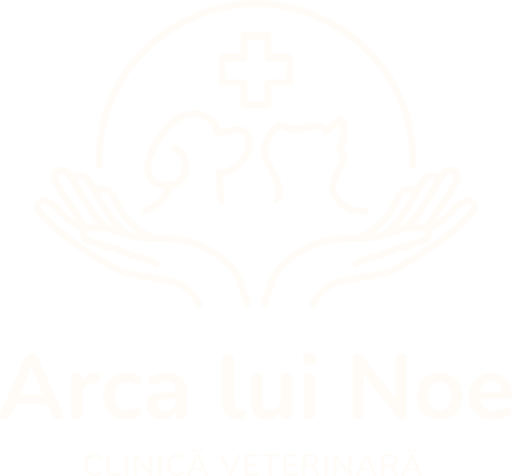

# Arca Lui Noe - Veterinary Clinic



## Overview

Arca Lui Noe is a modern veterinary clinic website built with Next.js. The platform provides an intuitive interface for pet owners to learn about our services, make appointments, and access pet care information.

## Features

- **Responsive Design**: Optimized for all devices (mobile, tablet, desktop)
- **Online Appointment Booking**: Easy-to-use scheduling system
- **Service Catalog**: Detailed information about veterinary services
- **Team Profiles**: Meet our veterinary professionals
- **Blog/News Section**: Latest updates and pet care advice
- **Contact Form**: Direct communication with the clinic
- **Interactive Maps**: Easy location finding

## Tech Stack

- **Frontend Framework**: Next.js
- **Styling**: Bootstrap CSS
- **State Management**: React Context API
- **Database**: MySql (or your preferred database)
- **Deployment**: Vercel (or your preferred hosting)

## Prerequisites

Before running this project, make sure you have the following installed:

- Node.js (v16.x or higher)
- npm or yarn
- Git

## Installation

1. Install dependencies:
   ```bash
   npm install
   # or
   yarn install
   ```

2. Set up environment variables:
   ```bash
   cp .env.example .env.local
   ```
   Then edit `.env.local` with your configuration.

3. Run the development server:
   ```bash
   npm run dev
   # or
   yarn dev
   ```

4. Open [http://localhost:3000](http://localhost:3000) in your browser to see the result.


## Acknowledgments

- Next.js team for the amazing framework
- All contributors and supporters of Arca Lui Noe